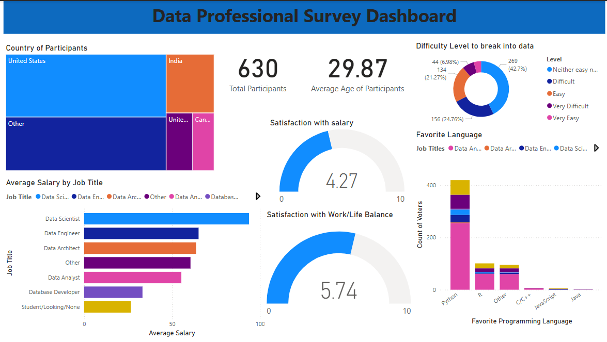

# Data Professional Survey - Power-BI Dashboard

## Project Overview
This project features a Power BI dashboard built using data from a survey conducted among professionals in the data field. It visualizes key metrics such as job titles, salary trends, job satisfaction, difficulty entering the field, and preferred programming languages. The goal is to explore industry trends and provide insights for aspiring and current data professionals.

## Contents
- Dashboard: Power BI dashboard file - https://github.com/sobiakarim/Data-Professionals-Survey---Power-BI/blob/main/Data%20Professional%20Survey.pbix

- Data: dataset used for visualization - https://github.com/sobiakarim/Data-Professionals-Survey---Power-BI/blob/main/Data%20Professional%20Survey.xlsx

- README.md: Project documentation (this file) - https://github.com/sobiakarim/Data-Professionals-Survey---Power-BI/blob/main/README.md

## Dashboard Overview

## Objectives
- Analyze the demographics and roles of data professionals  
- Explore salary distribution across various job titles  
- Understand job satisfaction in terms of salary and work-life balance  
- Identify challenges faced by newcomers in the data field  
- Highlight preferred programming languages by job roles

## Dashboard Highlights
- **Country of Participants**: Majority from the United States and India  
- **Total Participants**: 630  
- **Average Age**: 29.87 years  
- **Average Salary by Job Title**: Highest for Data Scientists  
- **Difficulty Entering Data Field**: Majority found it neither easy nor difficult  
- **Satisfaction Scores**:  
  - Salary Satisfaction: 4.27 / 10  
  - Work-Life Balance: 5.74 / 10  
-  **Favorite Programming Languages**: Python leads across job roles

## Dataset Information
- Source: Twitter Survey
- Rows: 630

##  How to Use  
1. Open `Data Professional Survey.pbix` in Power BI Desktop  
2. Click on visuals to filter data interactively  
3. Explore trends and relationships across different metrics

## Tool Used
- Power BI Desktop

##  Notes  
- Dataset is anonymized to protect privacy  
- All visuals are interactive and dynamically filterable  
- Designed for educational and analytical purposes  

